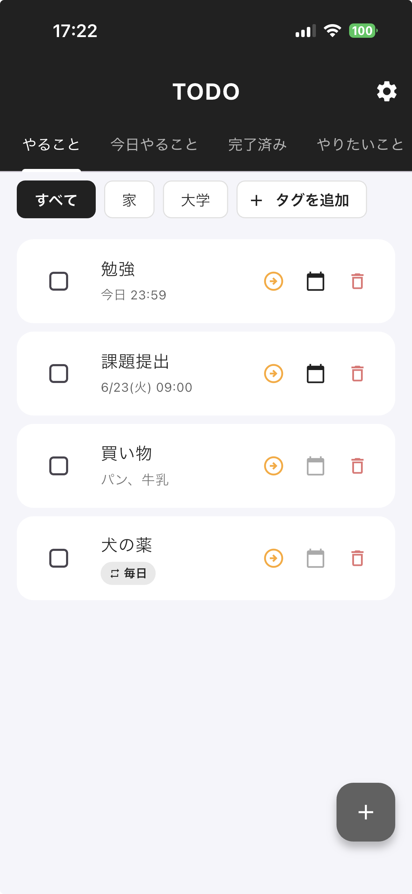
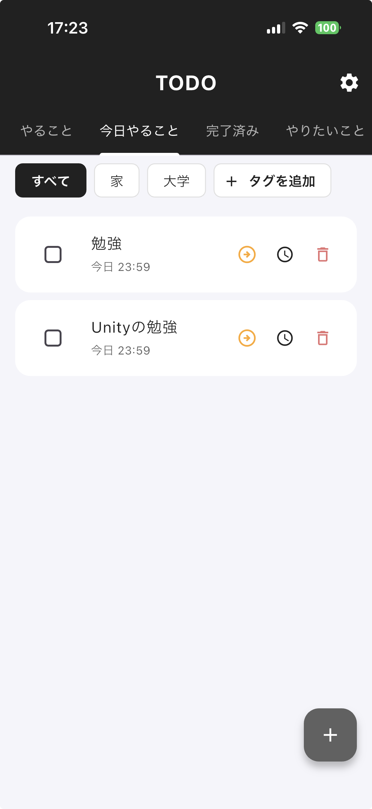
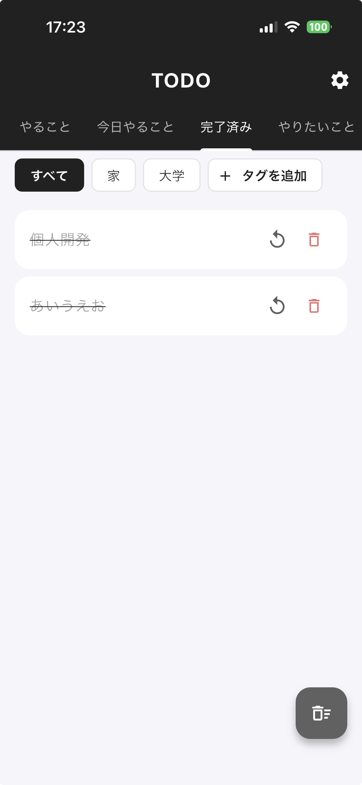
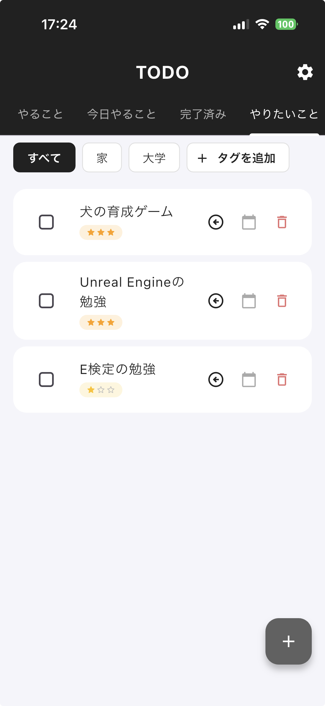
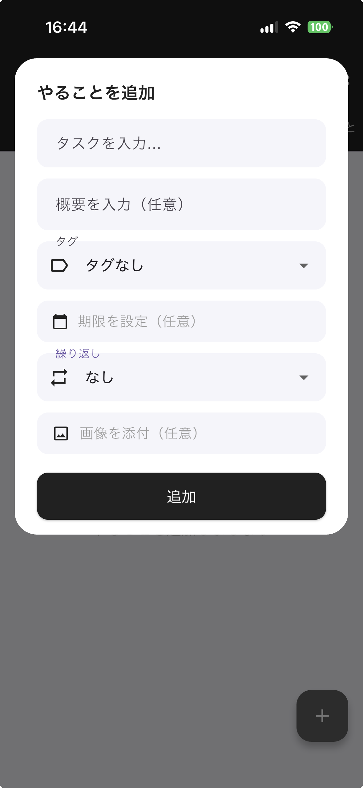
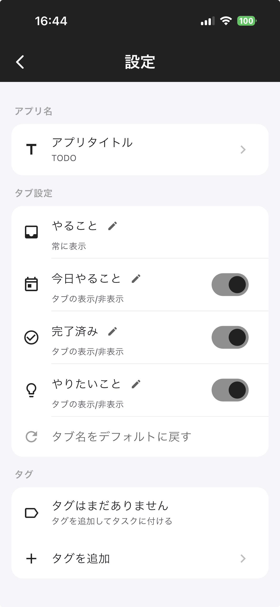
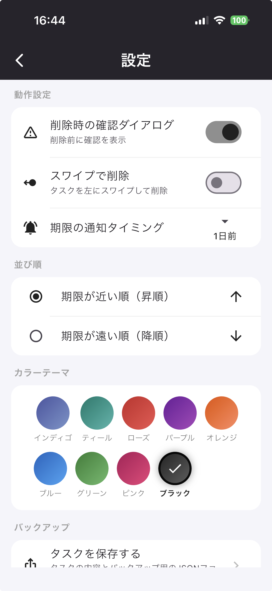
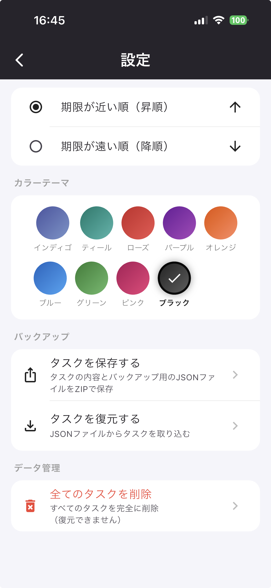

<h1 align="center">Todoアプリ（Flutter）<br>作品説明資料</h1>

# ポートフォリオ｜TODO アプリ（Flutter）

> 期限通知・画像添付・タグ分類・優先度・繰り返し・バックアップまで備えた、実用レベルのタスク管理モバイルアプリ。要件定義からデータモデル設計、UI/UX、機能実装、実機デプロイまでを個人で担当した。

| 項目 | 内容 |
|---|---|
| 氏名 | 木村 大暉 |
| 制作物 | ToDo 管理モバイルアプリ（iOS / Android） |
| 開発形態 | 個人開発 |
| 担当範囲 | 企画・設計・実装・実機デプロイ（全工程） |
| 開発期間 | 2025 年 5 月〜6 月（約 1 ヶ月） |
| コード規模 | Dart 約 4,800 行 |
| ソースコード | https://github.com/mocaluna0117/TODO_APP_ver3 |

---

## 1. 開発の背景・目的

> 既存の ToDo アプリは機能が多すぎたり、逆にシンプルすぎて期限通知やタグ整理ができなかったりと、自分の使い方に合うものが見つからなかった。そこで「必要な機能だけを、自分が一番使いやすい形で」実現したいと考え、個人開発に取り組んだ。

あわせて、**モバイルアプリ開発（Flutter / Dart）の実践力**と、**保守しやすいコード設計**を身につけることを目的とした。

---

## 2. 主な機能

### タスク管理

- タスクの追加・編集・削除（タイトル / 概要 / 期限 / 優先度 / タグ / 画像）
- 4 つのカテゴリタブで整理
  - **やること** … 通常のタスク
  - **今日やること** … 期限が今日まで（期限切れ含む）のタスクを自動抽出
  - **完了済み** … 完了したタスクを集約
  - **やりたいこと** … いつかやりたいタスクを別枠で管理
- カテゴリ間の移動、完了 / 未完了の切り替え、期限切れの強調表示

<p align="center">
  
  
  
  
</p>

### 期限・通知

- 日付＋時刻で期限を設定
- ローカル通知でリマインド（**期限の時間 / 10 分前 / 1 時間前 / 1 日前 / 通知しない**）
- 通知タイミングを変更すると、登録済みの全タスクを自動で再スケジュール
- タイムゾーン（Asia/Tokyo）を考慮した正確なスケジューリング

<p align="center">
  
</p>

### 分類・優先度・繰り返し

- **タグ**：自由に作成し、タスクへ付与・タグ単位でフィルタリング
- **優先度**：高 / 中 / 低 / なし（★の数で表示）（「今後やりたいこと」タブでの機能）
- **繰り返し**：なし / 毎日 / 毎週 / 毎月
- **並び順**：期限の昇順 / 降順

### 画像添付

- カメラ撮影・ギャラリー選択でタスクに画像を複数添付

### バックアップ（エクスポート / インポート）

- 全タスク / 完了済みタスクを **ZIP 形式（タスク内容を一覧化したtxtファイル ＋ 復元用のjsonファイル）** で書き出し
- JSON / ZIP ファイルから復元（**ID 重複を検出して二重登録を防止**、未登録タグも自動取り込み）

### カスタマイズ（設定画面）

- アプリ名・各タブ名の変更、タブの表示 / 非表示
- カラーテーマの選択（9 種類）
- 削除確認・スワイプ削除の ON/OFF、通知タイミング・並び順・タグの管理

<p align="center">
  
  
  
</p>

---

## 3. 技術スタック

| 分類 | 使用技術 |
|---|---|
| フレームワーク | Flutter（Dart SDK ^3.11） |
| UI | Material Design / Cupertino Icons |
| ローカル保存 | `shared_preferences`（JSON シリアライズ） |
| 通知 | `flutter_local_notifications` / `timezone` |
| 画像 | `image_picker` |
| 共有・ファイル | `share_plus` / `file_picker` |
| 圧縮 | `archive`（ZIP の生成・展開） |
| 国際化 | `flutter_localizations` / `intl` |
| アイコン / 起動画面 | `flutter_launcher_icons` / `flutter_native_splash` |

---

## 4. アーキテクチャ・設計の工夫

### 機能ベースのファイル分割

約 4,800 行のコードを「責務の単位」で細かくファイル分割し、可読性と保守性を高めた。

```text
lib/
├── main.dart                 # エントリポイント / part の集約
├── app/my_app.dart           # テーマ・ローカライズ設定
├── app_settings.dart         # アプリ設定モデル（永続化込み）
├── notification_service.dart # ローカル通知サービス（シングルトン）
├── models/todo_item.dart     # タスクのデータモデル
├── pages/todo_home/          # ホーム画面（機能別に細分化）
│   ├── core/                 # 画面本体・状態・データ入出力・クエリ
│   ├── actions/              # 追加/削除/移動/エクスポート/インポート
│   ├── dialogs/              # 各種ダイアログ
│   ├── form_fields/          # 日付・優先度・画像などの入力部品
│   └── list/                 # 一覧・カード・タグフィルタ表示
└── settings/                 # 設定画面（セクション/アクション/部品に分割）
```

### 巨大クラスを避ける `extension` 活用

画面の状態クラス `_TodoHomePageState` の振る舞いを、Dart の `extension` を使って
**データ入出力 / クエリ / エクスポート / インポート** などに分割。
1 つの巨大クラスにならないよう責務を分けている。

### 設定・通知の分離

設定モデル（`AppSettings`）と通知処理（`NotificationService`）を画面ロジックから独立させ、
通知はシングルトンで一元管理。状態と副作用を切り離す設計にした。

---

## 5. 技術的にこだわった点

### ① 後方互換性のあるデータ読み込み

アプリを更新してデータ構造が変わっても、**過去に保存したデータが壊れない**よう、
旧フォーマット（画像の単数フィールドや旧タグ名）からの読み込みに対応。
`normalize〜` 系の関数で値を安全に正規化している。

### ② インポート時の重複防止

バックアップ復元時に既存タスクの ID 集合と照合し、重複分はスキップ。
**「何件復元し、何件スキップしたか」をユーザーへフィードバック**する。

### ③ 通知の整合性を保つ

タスクの完了・削除・期限変更、設定でのタイミング変更時に通知を確実に再スケジュール / キャンセル。
過去日時の通知は登録しないなど、**不要・誤った通知が残らない**ように設計した。

### ④ 「今日やること」の動的抽出

カテゴリを手動で振り分けるのではなく、**期限が今日まで（期限切れ含む）のタスクをクエリで動的に抽出**。
ユーザーが仕分けし直す手間をなくした。

### ⑤ UI の堅牢性

OS の文字サイズ設定が極端でもレイアウトが崩れないよう、テキスト拡大率に上限・下限を設定。
タブ名は折り返さず縮小表示するなど、表示崩れ対策を行っている。

---

## 6. 苦労した点と解決方法

- **ローカル通知のタイミング制御**
  端末のタイムゾーンや「過去の時刻」を考慮しないと通知が飛ばない / 過去に飛ぶ問題があった。`timezone` パッケージで Asia/Tokyo を基準にし、過去日時はスケジュールしない条件分岐を入れて解決した。
- **ファイルの多重選択でクラッシュ**
  バックアップ復元でファイル選択を連打すると例外（multiple_request）が発生。選択中フラグを持たせて多重呼び出しを防いだ。
- **コードの肥大化**
  機能を足すほど 1 ファイルが膨らんだため、`part` / `extension` で責務ごとに分割し直し、保守しやすい構成へリファクタリングした。

---

## 7. この開発で学んだこと

- Flutter / Dart によるモバイルアプリ開発の一連の流れ（UI 構築・状態管理・永続化・実機デプロイ）
- 「動く」だけでなく**壊れにくく・直しやすい**コードにするための設計（責務分割、副作用の分離）
- 実際のユーザー体験を意識した機能設計（通知・バックアップ・エラー時のフィードバック）

---

## 8. 今後の展望

- 通知の複数回数設定
- クラウド同期 / マルチデバイス対応（現状は端末ローカル保存）
- ダークモード対応
- タスクの検索・複数タグ付け
- ホーム画面ウィジェットからのクイック追加
- 自動テスト（ウィジェットテスト・ロジックの単体テスト）の拡充

---

## 9. 動作環境・実行方法

```bash
# 依存パッケージの取得
cd todo_app
flutter pub get

# 開発実行
flutter run

# iPhone 実機へのリリースビルド
flutter run --release
```

- 必要環境：Flutter SDK（Dart ^3.11）、iOS / Android の実機またはシミュレータ
- 外部サーバー不要・完全オフラインで動作する
