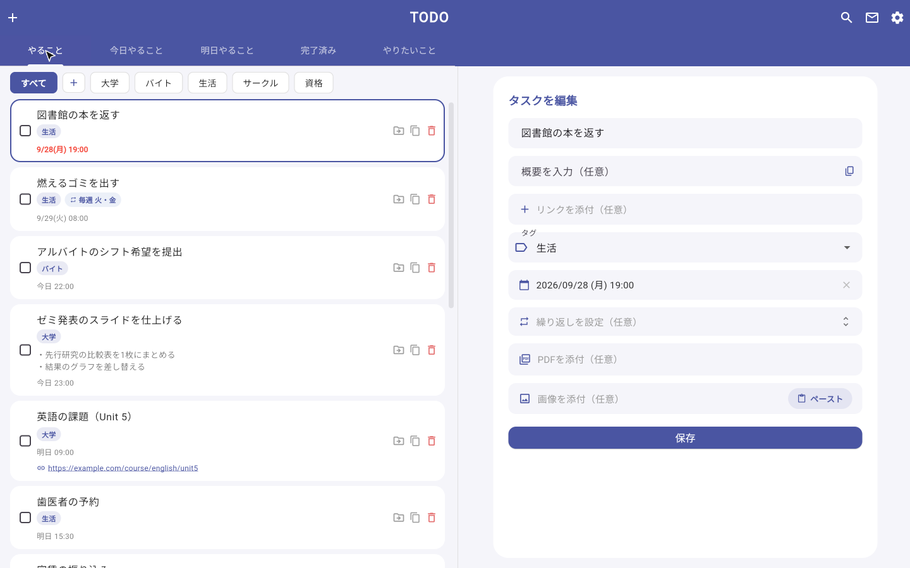
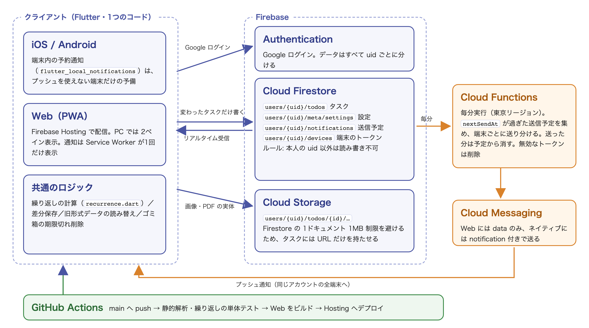
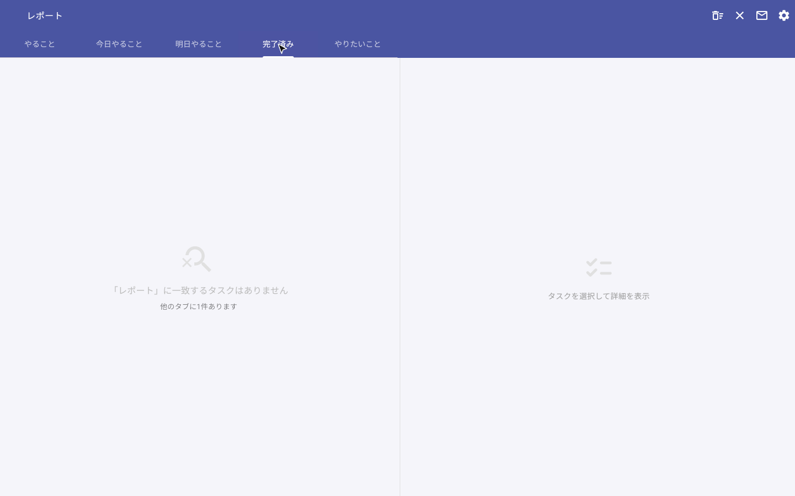
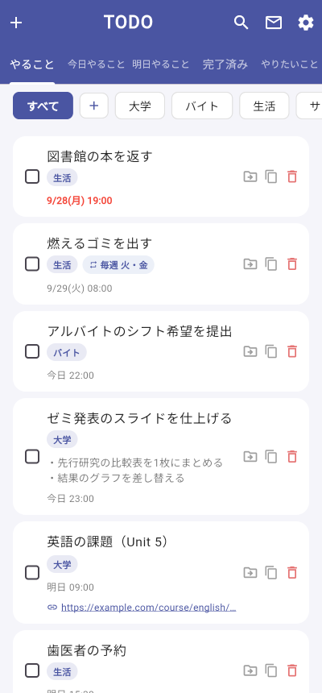
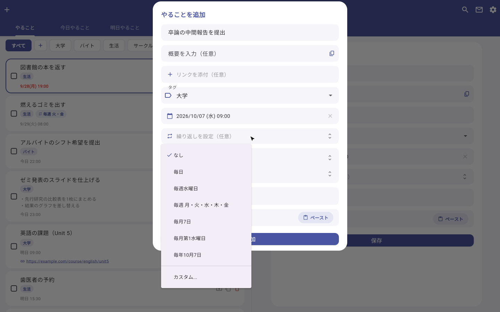
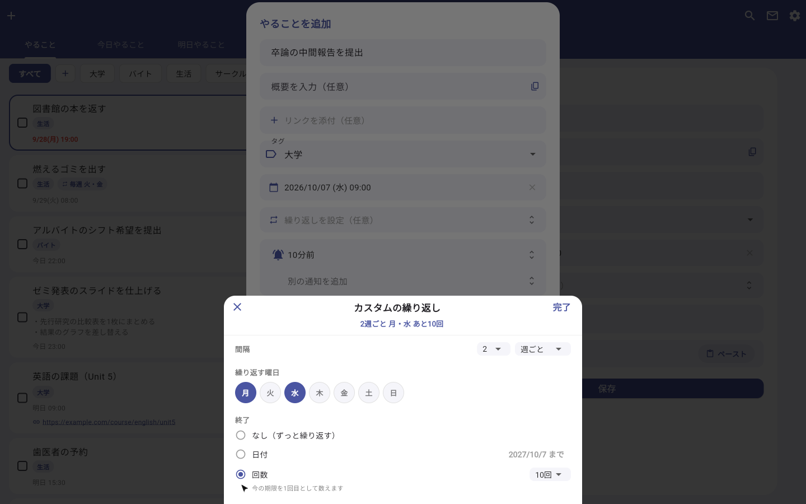
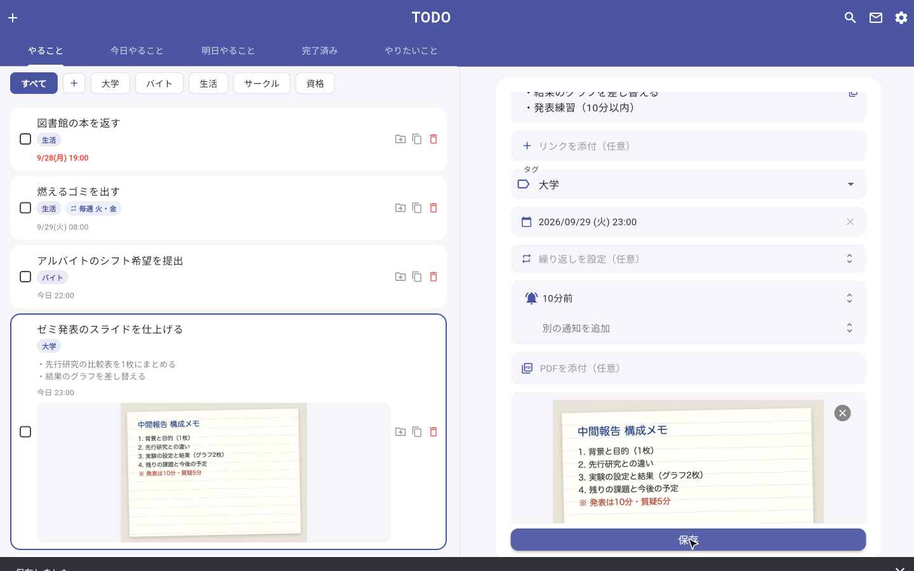
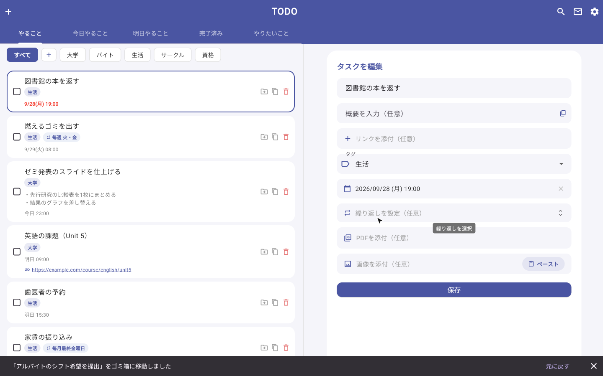
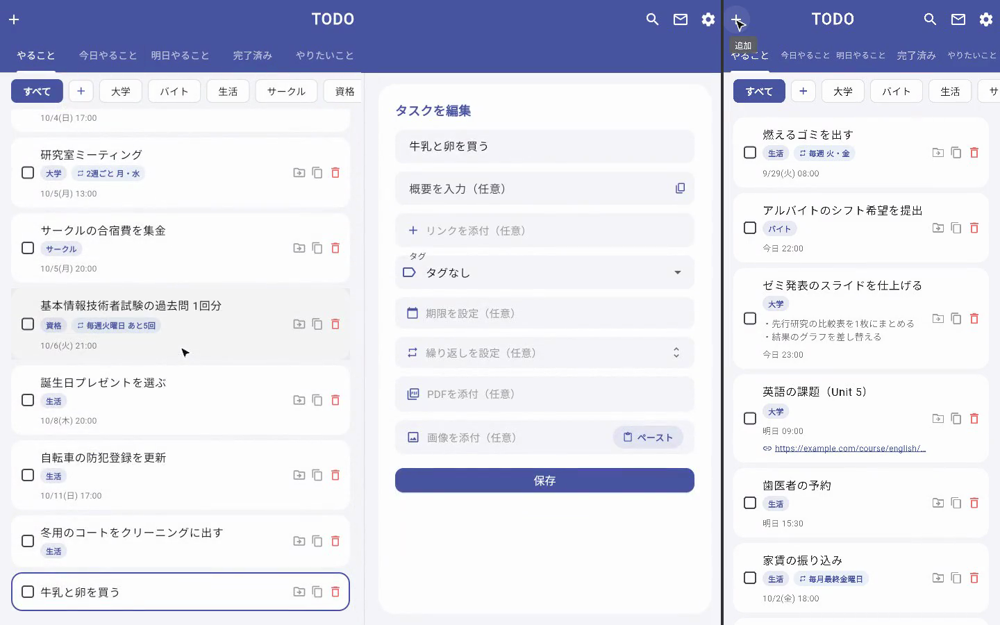
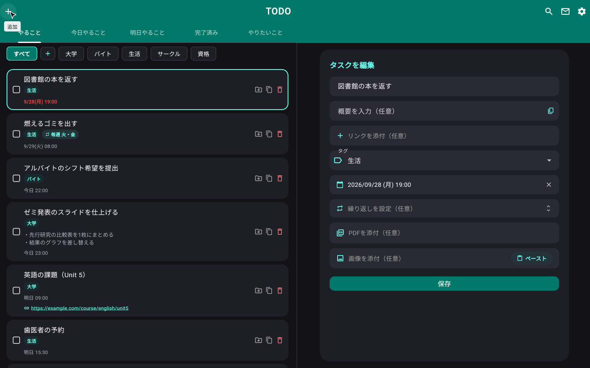

<h1 align="center">TODO アプリ（Flutter）<br>作品説明資料</h1>

**スマートフォン・PC のどちらからでも同じタスクを扱える、個人開発のタスク管理アプリ**である。Flutter の1つのコードから iOS・Android・Web を作り、Firebase で端末間の同期と、端末をまたいだプッシュ通知を実現した。企画・設計・実装・デプロイまでを一人で行い、自分で日常的に使いながら改修を続けてきた。

| 項目 | 内容 |
|---|---|
| 氏名 | 木村 大暉 |
| 区分 | 個人開発（モバイル／Webアプリケーション） |
| ソースコード | https://github.com/mocaluna0117/TODO_APP_ver3 |
| 実行ファイル（bin） | なし（iOS・Android・Web 向けのアプリのため exe は無い）。動画と「8. 動作確認方法」の単体テストの手順で確認できる |
| 動作紹介動画 | <https://github.com/mocaluna0117/TODO_APP_ver3/blob/main/docs/portfolio/todo-demo.mp4>（約2分25秒） |

> 本資料の画面写真と動画はすべて、手元に立てた Firebase のエミュレータ（本番とは切り離した環境）で、**デモ用に作った架空のタスク**を使って撮影した。アプリのコードは、接続先をエミュレータに向ける数行を除いて本番と同一である。

<p align="center">
  
</p>

---

## 1. 制作意図

既存の ToDo アプリは、機能が多すぎて操作が重いか、逆に簡素すぎて期限の通知やタグでの整理ができないかのどちらかで、自分の使い方に合うものが見つからなかった。そこで「必要な機能だけを、自分が一番使いやすい形で」作ることにした。

作り始めてから実際に使う中で、次の3つを目標に据えた。

- **どの端末からでも同じ内容を扱える**こと（スマホで追加したタスクを PC で編集し、通知はどちらにも届く）
- **繰り返しの予定を、暦どおりに正しく回せる**こと（「2週ごとの月・水」「毎月最終金曜日」「毎月31日」など）
- **消した・間違えたを取り返せる**こと（削除はゴミ箱へ、バックアップの書き出しと復元）

あわせて、モバイルアプリ開発（Flutter / Dart）の実践力と、長く手を入れ続けられるコードの書き方を身につけることも目的とした。

---

## 2. 開発概要（提出要項の必須項目）

| 項目 | 内容 |
|---|---|
| **開発期間** | 2026年3月〜8月（約6か月）。現在も自分で使いながら改修している |
| **所要時間（概算）** | 約50時間以上（コミット時刻から算出した作業時間の下限。2026年5月15日に一括でコミットした最初の骨組みの制作時間は含まない） |
| **開発メンバー数・構成** | 1名 |
| **自身の担当範囲** | 全工程。企画・要件の決定、データ構造と画面の設計、実装、Firebase（認証・DB・ストレージ・関数）の構築、GitHub Actions による自動デプロイ、実機での動作確認 |
| **動作環境** | iOS・Android（Flutter のネイティブアプリ）、Web（PC・スマートフォンのブラウザ。ホーム画面に追加できる PWA）。画面幅 1000px 以上では2ペイン表示になる |
| **操作方法** | Google アカウントでログインする。左上の「＋」でタスクを追加し、カードのチェックで完了、ゴミ箱アイコンで削除する。上部のタブで「やること／今日やること／明日やること／完了済み／やりたいこと」を切り替え、虫眼鏡で検索、歯車で設定を開く（詳しくは「4. 主な機能」と動画） |
| **制作意図** | 1章のとおり。自分の使い方に合うタスク管理を作る。どの端末からでも同じタスクを扱え、繰り返しの予定を暦どおりに回せ、消した・間違えたを取り返せるようにする |
| **規模** | Dart 約10,400行（82ファイル）＋ 単体テスト 約730行 ＋ Cloud Functions（JavaScript）150行。コミット177件 |

---

## 3. 技術スタックとアーキテクチャ

Flutter の版は GitHub Actions の設定（`.github/workflows/deploy-web.yml`）で 3.47.1 に固定しており、Dart はそれに同梱の版である。Dart パッケージの版は `todo_app/pubspec.lock`、Cloud Functions の版は `functions/package-lock.json`、Web で読み込む JS の版は `web/` のファイル内の URL で固定されているものである。

| レイヤ | 技術 |
|---|---|
| クライアント | **Flutter 3.47.1**（Dart 3.13.1）。iOS / Android / Web を1つのコードから生成 |
| 認証 | Firebase Authentication（firebase_auth 6.5.4、firebase_core 4.11.0）。Google ログイン |
| データ | Cloud Firestore（cloud_firestore 6.6.0）。タスク・設定・通知の送信予定・端末のトークン。リアルタイム同期 |
| ファイル | Cloud Storage for Firebase（firebase_storage 13.4.3）。画像・PDF の実体 |
| 通知 | Firebase Cloud Messaging（firebase_messaging 16.4.1、Web の Service Worker は Firebase JS SDK 10.14.1）＋ Cloud Functions（Node.js 22、firebase-functions 6.6.0、firebase-admin 12.7.0。毎分実行）。プッシュを使えない端末は flutter_local_notifications 21.0.0（timezone 0.11.0）で端末内に予約 |
| 配信・CI | Firebase Hosting（Web 版）、GitHub Actions（main への push で解析・テスト・ビルド・デプロイ） |
| 主なパッケージ | image_picker 1.2.2 / file_picker 10.3.10 / pasteboard 0.5.0（画像の貼り付け）/ archive 4.0.9（ZIP の書き出し）/ flutter_image_compress 2.4.0（HEIC → JPEG。Web は heic2any 0.0.4）/ cached_network_image 3.4.1 / shared_preferences 2.5.5 / share_plus 12.0.2 / url_launcher 6.3.2 / intl 0.20.3 |

### アーキテクチャ

<p align="center">
  
</p>

- **サーバーを自前で持たない。** 端末間の同期と通知の配信だけが目的なので、Firebase の機能を組み合わせ、自分で書くサーバー処理は通知を送る関数1本（150行）に絞った
- **データは利用者ごとに完全に分ける。** すべて `users/{uid}/…` の下に置き、Firestore のルールで「本人の uid 以外は読み書きできない」と決めている
- **通知の予定はサーバー側に持たせる。** 端末内の予約だと、その端末でしか鳴らない。タスクを保存するときに「いつ・何を送るか」を Firestore に書き、毎分動く関数がそれを見て、同じアカウントの全端末へ送る

---

## 4. 主な機能

### 整理する

- **5つのタブ** … 「今日やること」「明日やること」は手で振り分けるのではなく、期限の日付から自動で抽出する。「やりたいこと」は期限の無い目標を★の優先度つきで別枠に置く
- **タグ** … 「やること」用と「やりたいこと」用で別々に持ち、ドラッグで並べ替えられる
- **検索** … タイトル・概要・タグ・リンクが対象。一致しないタブでは「ほかのタブに◯件あります」と案内する
- **PC では2ペイン** … 左の一覧をスクロールすると、右の詳細が「いま見ているタスク」へ追従する

<p align="center">
  
  
</p>
<p align="center"><sub>左: 検索。完了済みタブには一致が無いので、ほかのタブの件数を案内している ／ 右: スマートフォンでの表示</sub></p>

### 予定を立てる

- **期限と複数の通知** … 「期限の時間／10分前／1時間前／1日前／任意の分数」をタスクごとに複数つけられる
- **繰り返し** … 期限を入れると「毎週水曜日」「毎月第1水曜日」のように候補が具体化される。カスタム設定では、間隔（n日・n週・nか月・n年ごと）、曜日の複数指定、月内の位置（日付／第n○曜日／最終○曜日）、終わり方（終了日／回数）を組み合わせられる
- **繰り返しタスクの完了** … チェックすると「次回に進める」か「繰り返しを終了して完了」を選べる

<p align="center">
  
  
</p>
<p align="center"><sub>左: 期限（10/7 水）から具体化された候補 ／ 右: カスタム設定。「2週ごと 月・水 あと10回」</sub></p>

### 残す・戻す

- **画像・PDF・リンクの添付** … 画像はカメラ・ファイル選択・貼り付け（Ctrl/Cmd+V）で追加でき、iPhone の HEIC 形式は JPEG に変換する。PDF は1件20MBまで
- **ゴミ箱** … 削除は即座に消さずゴミ箱へ移し、直後の通知の「元に戻す」で1回で戻せる。7日を過ぎたものは添付ファイルごと自動で消す
- **複製** … 画像と PDF も含めて複製する
- **バックアップ** … 全タスク／完了済みを ZIP（人が読める .txt ＋ 復元用の .json）で書き出し、JSON／ZIP から復元する。ID の重複を検出して二重登録を防ぐ

<p align="center">
  
  
</p>

### どの端末でも

- **リアルタイム同期** … スマホで完了・追加したタスクが、開いている PC の画面にすぐ反映される（動画の SCENE 7）
- **端末をまたぐ通知** … PC で設定した通知が、アプリを開いていないスマホにも届く
- **設定の同期** … タグ・配色・通知の既定値なども端末間で同じになる。ダークモードと9色のカラーテーマを選べる

<p align="center">
  
  
</p>
<p align="center"><sub>左: スマホで追加した「牛乳と卵を買う」が PC の一覧にも出ている ／ 右: ダークモード＋ティールの配色</sub></p>

---

## 5. 技術的に工夫した点

### (1) 繰り返しの計算を「暦のずれ」まで詰めた 📅

最初の繰り返しは「毎日／毎週／毎月…」を列挙した選択肢で、完了のたびに**そのときの期限**から次回を計算していた。この作りを「間隔・曜日・月内の位置・終了条件」を自由に組み合わせる形へ作り替えたとき、暦の端で次の問題が出ることが分かった。

- **月末で一度丸めると、以降ずっとずれる。** 「毎月31日」は2月に28日へ丸める必要があるが、その28日を基準に次を計算すると、3月以降も28日のままになる。「毎月第5月曜日」を第5週の無い月で最終月曜に丸めた場合も同じである。そこで、曜日や日を省略した設定は**最初の完了時に期限から基準を確定**し（`resolvedFor`）、以降は丸めた後の日付ではなく確定した基準から毎回計算するようにした
- **隔週の位相がずれない基準を決めた。** 「2週ごとの月・水」は、期限の週の月曜日を起点に `7 × 間隔 × n` 日ずつ進めて候補を作る。完了した日から数えると、完了が遅れた週に位相が崩れるためである
- **期限が何年も前でも一度で追いつく。** 「3日ごと」で期限が大きく過ぎていた場合、1回ずつ足すのではなく、経過日数を間隔で割って必要な回数をまとめて足す。条件を満たす日が見つからない設定に備え、探索は600回で打ち切り、無限ループにしない
- **壊れた値・古い形式でも落ちない。** 保存データの範囲外の値は丸めるか無視し、旧形式（列挙名・番号）で保存されたタスクは読み込み時に新形式へ変換する。アプリを更新しても、過去のデータがそのまま使える
- **境界の例を単体テストで固定した。** うるう年の2/29（平年は2/28へ）、毎月31日、第5月曜日、最終金曜日、隔週の位相、期限が過去の場合、終了日と同じ日の回、JSON の往復、旧形式からの移行など **37件**のテストを書き（`test/recurrence_test.dart`）、GitHub Actions で push のたびに実行している。2026年9月29日時点で37件すべて成功し、静的解析（`flutter analyze`）の指摘は0件である

### (2) 「通知が2件届く」を、原因の取り違えから立て直した 🔔

端末をまたぐ通知を入れた直後、**iPhone でだけ同じ通知が2件届いた**。PC の Chrome では1件に見えていた。

1. **最初の見立て**: サーバーは通知を `notification` 付きで送っており、Firebase の SDK が自動で表示するうえに、Service Worker でも自分で表示していた。Chrome は同じ `tag` の通知をまとめるので1件に見え、iOS Safari はまとめないので2件になった、と判断し、Service Worker 側の表示を止めた
2. **その修正で別の不具合が出た**: Web では Service Worker の表示が**タブを閉じているときの唯一の表示経路**だったため、タブを閉じると通知が1件も出なくなった。最初の見立ては「二重に表示する経路がある」という点では正しかったが、消す側を間違えていた
3. **表示経路を1つに確定させる作りに直した**: Web へは `data` だけを送って Service Worker が必ず1回だけ表示し、ネイティブへは `notification` 付きで送って OS に表示させる、と**端末の種類ごとに送り方を分けた**（`functions/index.js`）
4. **もう1つの原因も断った**: 端末のトークンは再登録で変わるため、古いトークンが残ると同じ端末に2回送られる。端末ごとに固定の ID を持たせ、トークンを登録するときに同じ端末の古い登録を消すようにした。送信に失敗した無効なトークンも関数側で消す

このほか、iPhone のホーム画面アプリでは**起動時に自動で通知の許可を求めると拒否扱いになり、二度と許可を求められなくなる**ため、許可は設定画面のボタン（利用者の操作）から求める形にした。プッシュを使えない端末では端末内の予約通知に切り替え、プッシュが使える端末では端末内の予約を持たないことで、二重に鳴らないようにしている。

### (3) 同期で「無駄な書き込み」と「添付の事故」を防いだ ☁️

端末間の同期を入れた当初は、保存のたびに**全タスクを Firestore へ書き直して**いた。Firestore は書き込み回数で無料枠を消費するため、タスクが増えるほど1回の保存が重くなる。

- **変わったタスクだけ書く。** 最後に受信した内容を JSON 文字列で覚えておき、保存時に比べて違うタスクだけを書き込む。変更が無ければ通信自体を行わない。コードから数えると、タスク22件のデモデータで1件を編集した場合、書き込みは**22回から2回**（タスク本体と通知の送信予定）になる
- **添付はタスクに入れない。** Firestore の1ドキュメントは1MBまでなので、画像を Base64 のまま持つとすぐ上限に掛かる。画像と PDF の実体は Storage に置き、タスクには URL とファイル名だけを持たせた。パスは毎回一意で中身が変わらないため、長期キャッシュを指定して2回目以降のダウンロードを無くした
- **複製で添付を共有させない。** 添付の URL をそのまま複製すると、Storage 上の同じ実体を2つのタスクが指し、片方を消すともう片方の添付が壊れる。複製時は実体を読み込み直し、「まだアップロードしていない添付」として新しいタスクの場所へ入れ直す
- **消したものを残さない。** タスクの削除や、編集で外した添付は、Storage からも消す（孤立したファイルを残さない）
- **端末内のデータから一度だけ移す。** 同期を入れる前は端末内に保存していたため、初回ログイン時にだけクラウドへ移行する。移行済みかどうかはフラグで判定し、削除したタスクが次の起動で復活しないようにした。タグは端末とクラウドの和集合を取り、どちらの分も失わない

### (4) 2ペインの「いま見ているタスク」を式で決めた 🖱️

PC の2ペインで、左の一覧のスクロールが止まったら、右の詳細を「いま見ているタスク」へ切り替えるようにした。一覧の上端から少し下に**基準線**を引き、そこに掛かっているカードを選ぶ。

作ってみると、基準線を上端付近に固定すると**末尾の数件は基準線まで上がってこられず選べない**。そこで「残りのスクロール量」に応じて基準線を下げたが、今度は**スクロールできる距離が画面の高さより短い一覧で、先頭のタスクが選べなくなった**。最終的に、基準線の位置を次の式で決めた。

```
sweep  = min(画面の高さ H, 最大スクロール量)
offset = H × (1 − 残りのスクロール量 / sweep)   … 基準線の、上端からの距離
```

上端ぎりぎりに残っているだけのカードを選ばないよう、`offset` の下限は24px とした（一番上まで戻したときは、先頭を選べるよう下限も下げる）。

長い一覧では最後の1画面に入るまで基準線は上端にあり、短い一覧ではその短い距離で上端から下端まで動く。**どちらの場合も、一番上では先頭、一番下では末尾のタスクになる。** あわせて、右に未保存の入力があるときは切り替えない（入力を捨てない）、何も選んでいないときはスクロールだけで開かない、タブを戻したときの自動スクロールでは追従しない、とした。

### (5) 使う人を想定した細部 🧑‍🔧

- **Web では画像のキャッシュ部品を使わない。** Web 版で、画面外へスクロールして戻した画像が黒く描かれる現象が出た。調べると、使っていた `cached_network_image` は Web ではキャッシュを行わない（公式の説明）うえに、再描画時に同じ不具合の報告があった。Web ではブラウザのキャッシュが効くので標準の `Image.network` に切り替え、オフライン表示が必要な iOS / Android だけ従来どおりにした
- **文字の拡大率に上限と下限を設ける。** OS の文字サイズ設定が極端でもレイアウトが崩れないようにした
- **削除は取り返せる形にする。** 確認ダイアログ・ゴミ箱・直後の「元に戻す」の3段にした。ゴミ箱のタスクは一覧・通知・バックアップの対象から外す

---

## 6. ゲーム開発のプログラマとして活かせると考える点

ゲームではないが、以下はゲーム開発にも通じる経験だと考えている。

- **複数の端末で同じ状態を保ち、出来事を一度だけ届ける設計。** 同期では、最後に受け取った内容を基準に変わった分だけを送り、送る量を抑えた。通知では、表示する経路を端末の種類ごとに1つに決め、端末ごとの固定 ID で古い登録を消して、同じ通知が二重に届かないようにした。複数のプレイヤーや端末が同じ状態を見るオンラインのゲームでも、送る量を抑えながら、状態の食い違いやイベントの二重発生を防ぐ必要があり、同じ構造の問題だと考えている
- **1つのコードで、画面も入力も違う複数の機種に合わせる経験。** 同じコードから iOS・Android・Web を作り、画面幅に応じてスマホの1列表示と PC の2ペイン表示を切り替えた。タッチとマウスのホイール、ソフトウェアキーボード、OS の文字サイズ設定の違いも吸収した。携帯機と据え置き、解像度や入力機器の違う複数の機種に出すゲームの開発に活かせる
- **入力と画面の振る舞いを、使う人の操作から逆算して設計する姿勢。** 2ペインの追従では、「スクロールを止めたら、そのとき見ているタスクが開く」という期待に合わせて基準線の動かし方を決めた。そのうえで、右に書きかけの入力があるときは切り替えない、何も選んでいないときは勝手に開かない、タブを戻したときの自動スクロールには反応しない、と「期待と違う動き」になる場面を1つずつ潰した。ゲームの UI やメニュー、入力まわりでも、プレイヤーの操作を先回りして、意図しない切り替わりや入力の取りこぼしを防ぐ設計が求められると考えている

---

## 7. AI利用箇所の明記

> 提出要項「※AIを利用したアセット・コードが含まれる場合は、利用箇所を具体的に明記してください」に基づく記載である。

### 開発でのAIの利用

2026年5月25日以降の開発では、AIコーディングエージェント **Claude Code（Anthropic）** などのAIを使用した。**マージを除くコミット168件のうち、5月25日以降の150件はAIを使って作ったもの**である。このうち96件にはAIが共同作成者として記録されており、記録の無い54件もAIによるものである。

- **〜2026年5月24日（最初の骨組み、コミット18件）**: タスクの一覧・追加と編集・端末内への保存・最初の通知・画像の添付など、アプリの土台は**自分の手で書いた**
- **2026年5月25日以降（コミット150件）**: AIが生成したコードを、**変更を1つずつ自分が確認・承認してから次へ進める**形で開発した。タブ・繰り返し・バックアップ、7月以降の Firebase 対応（同期・通知・添付）、8月の改修は、いずれもAIが生成したコードである
- **自分が担ったこと**: 作る機能と優先順位の決定、画面の使い勝手の判断、AIの提案の採否、実機（iPhone・Android・PC のブラウザ）での動作確認と不具合の発見、Firebase コンソールや GitHub 側での設定
- **AIが担ったこと**: 実装コードの生成、不具合の原因調査の補助、単体テストの作成、コミットメッセージ・コメントの下書き

### アプリの中でのAIの利用

なし。アプリの機能として生成AIは使っていない。

### 本資料・動画でのAIの利用

- **デモ環境と架空のデータ**: Claude Code が、Firebase のエミュレータを使ったデモ環境（本番とは切り離した環境）と、架空のタスク22件・架空のアカウントを作成した
- **デモ動画と画面写真**: Claude Code がブラウザ自動操作ツール（Playwright）で操作・録画し、ffmpeg で編集した。見出しカード・添付用のメモ画像・構成図も Claude Code が作成した
- **本資料の文章**: Claude Code が、ソースコードと git の履歴を読んで下書きし、内容を自分で確認・修正した
- **リポジトリの README**: 本資料を作るのに合わせて、Claude Code が今の実装に合わせて書き直し、内容を自分で確認した

---

## 8. 動作確認方法

### 動画で確認する

`todo-demo.mp4`（約2分25秒）に、タブと2ペイン表示（スクロールへの追従）→ タスクの追加（期限・カスタムの繰り返し・複数の通知）→ 繰り返しタスクの完了 → 画像の添付 → 検索 → 削除と「元に戻す」→ PC とスマホの同時表示による同期 → ダークモード、までを収録している。

### 手元でテストを動かす

iOS・Android・Web 向けのアプリのため、Windows の実行ファイル（exe）は用意していない。繰り返しの計算は、Firebase に接続せずに単体テストで確かめられる。

```bash
# 前提: Flutter 3.47.1（CI と同じ版）
cd todo_app
flutter pub get
flutter test test/recurrence_test.dart   # 繰り返しの計算のテスト（37件）
```

---

## 9. リポジトリ構成（抜粋）

```
TODO_APP_ver3/
├── todo_app/
│   ├── lib/
│   │   ├── main.dart                  # 起動・Firebase 初期化
│   │   ├── models/
│   │   │   ├── recurrence.dart        # 繰り返しの設定と次回の計算
│   │   │   └── todo_item.dart         # タスクのデータ構造（旧形式の読み替えを含む）
│   │   ├── notification_service.dart  # プッシュの登録と、端末内の予約通知（予備）
│   │   ├── pages/todo_home/
│   │   │   ├── core/                  # 画面本体・同期と差分保存・2ペインの追従
│   │   │   ├── actions/               # 追加／削除／複製／書き出し／復元
│   │   │   ├── dialogs/ form_fields/  # ダイアログと入力部品（繰り返しのシートなど）
│   │   │   ├── list/                  # 一覧・カード・検索・タグの絞り込み
│   │   │   └── media/                 # 画像・PDF の添付と Storage への送信
│   │   └── settings/                  # 設定画面
│   ├── functions/index.js             # 毎分実行の通知送信（Cloud Functions）
│   ├── firestore.rules                # 本人の uid 以外は読み書き不可
│   ├── web/firebase-messaging-sw.js   # Web のプッシュ通知の表示
│   └── test/recurrence_test.dart      # 繰り返しの単体テスト（37件）
├── .github/workflows/deploy-web.yml   # 解析・テスト・ビルド・Hosting へのデプロイ
└── docs/portfolio/                    # 本資料・画像・動画
```
